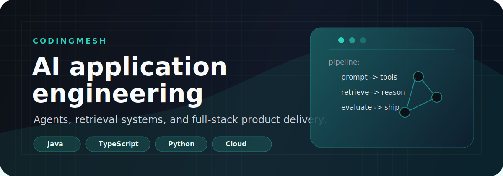

  

  
  
  
  

# CodingMesh

全栈工程师，专注 LLM 应用、AI Agent、RAG 系统和云原生产品工程。

I build AI-native tools with the boring parts included: maintainable interfaces, deployment paths, observability, and room for iteration.

- Based in Kunming, China
- Focused on agent workflows, retrieval systems, multimodal interfaces, and product-grade automation
- Comfortable across Java, TypeScript, Python, Go, and modern frontend stacks
- Open to collaboration on practical AI systems and research-driven products

## What I Build

| Area | Focus |
| --- | --- |
| AI agent systems | Tool use, workflow orchestration, memory, evaluation loops |
| RAG pipelines | Chunking, ranking, retrieval quality, domain knowledge integration |
| Full-stack products | Clean interfaces, API design, auth, persistence, deployment |
| Cloud-native delivery | Docker, Kubernetes, CI automation, service reliability |

## Selected Work

| Project | What it is | Stack | Links |
| --- | --- | --- | --- |
| Omni Chat | Multimodal chat platform for model-powered conversations | Vue, FastAPI, LangChain, OpenAI | [Repo](https://github.com/codingmesh/omni-chat) [Live](https://omni-chat.termiubot.cn) |
| Cert Manager | SSL certificate lifecycle manager with renewal and reminders | Python, Vue, PostgreSQL | [Repo](https://github.com/codingmesh/cert-manager) [Live](https://cert.termiubot.cn) |
| DeepResearch Agent | Research workflow system built around retrieval and LLM reasoning | LangChain, OpenAI, RAG, FastAPI | [Repo](https://github.com/codingmesh/deepresearch-agent) |
| Password Generator | Small security utility for generating and checking passwords | JavaScript, CSS, Web Crypto API | [Repo](https://github.com/codingmesh/password-generator) [Live](https://passwd.termiubot.cn) |
| FlipClock | Customizable flip clock interface | Vue 3, TypeScript, Vite | [Repo](https://github.com/codingmesh/flip-clock) |

## Toolbox

| Layer | Tools |
| --- | --- |
| Languages | `Java` `TypeScript` `JavaScript` `Python` `Go` `Rust` |
| Frontend | `Vue` `React` `Next.js` `Vite` `Tailwind CSS` |
| Backend | `Spring Boot` `Node.js` `Express` `FastAPI` |
| Data | `PostgreSQL` `MySQL` `Redis` `MongoDB` |
| AI | `OpenAI` `Claude` `LangChain` `LlamaIndex` `Transformers` `PyTorch` |
| Delivery | `Docker` `Kubernetes` `GitHub Actions` `Nginx` `Linux` |

## Current Focus

- Reliable agent workflow orchestration
- RAG quality measurement and retrieval tuning
- Multimodal app experiences that feel useful, not ornamental
- Cloud-native patterns for small but serious products
- Developer tooling that removes repetitive operational work

## GitHub Signals

  

## Writing

<!-- BLOG-POST-LIST:START -->
- [云原生应用开发最佳实践](https://termiubot.cn/blog/cloud-native-best-practices)
- [TypeScript 高级特性详解](https://termiubot.cn/blog/typescript-advanced)
- [Docker 容器化实战指南](https://termiubot.cn/blog/docker-in-action)
<!-- BLOG-POST-LIST:END -->

## Connect

  
  
  
  

